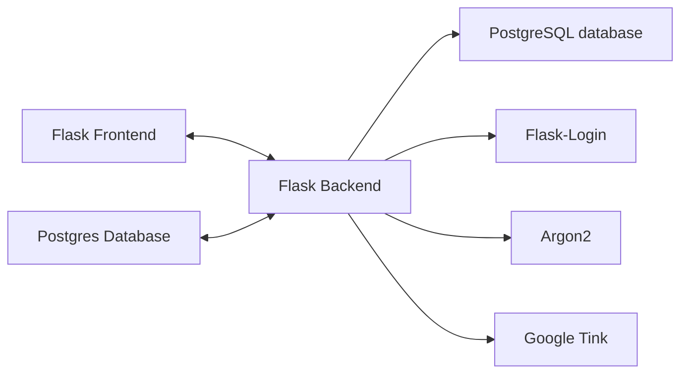
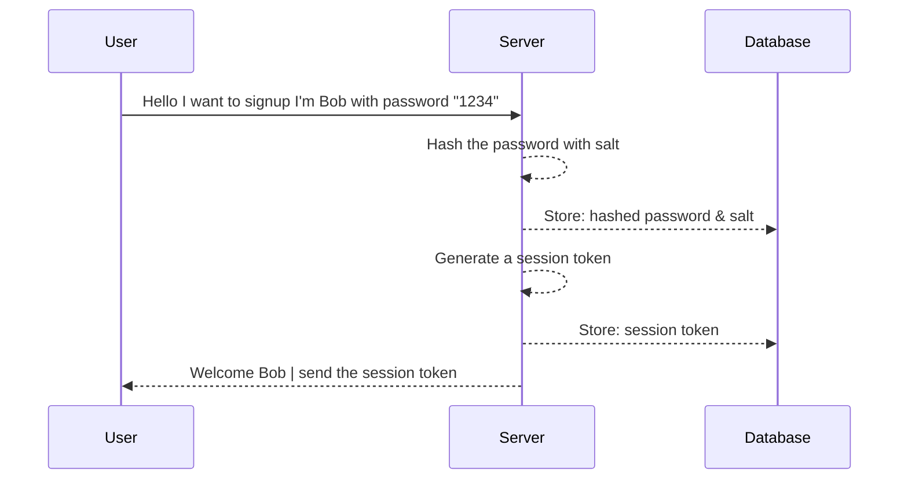
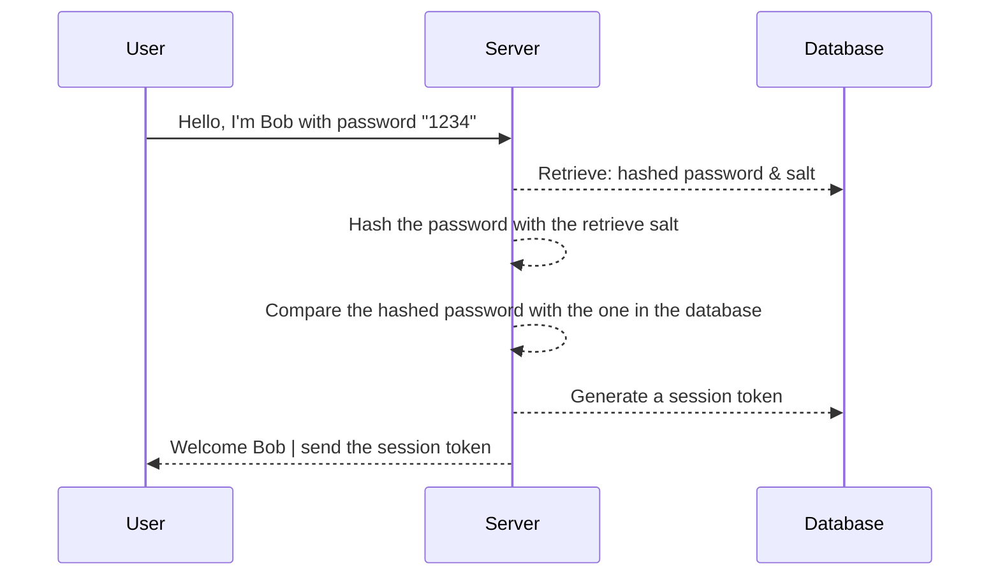

    
    
    

        <h3 style="font-size: 16px;">Project CryptoGraphie</h3>
        <h3 style="font-size: 16px;">Guillaume Dorschner & Jules Deleuse</h3>
        <h3 style="font-size: 16px;">A4 - CCC</h3>
    

    

# Project Implementation

Requirement for the implementation: password storage. Think about it as you are building some application that has user system (username and password) and you need to store the password securely. You should implement your solution, taking into accounts all the attack scenarios we have discussed. Basically the grade will be scored according to how secure your implementation is. The implementation needs to be runnable, where I can enter my username and password for registration and logging in (the interface can be a web app, or terminal etc).

If you are using any cryptographic encryption implementation, you need to use [google tink library](https://developers.google.com/tink) (except for the hash functions). Implementation using other libraries does not count.

# What we will be using

All the code is written in Python, and we will be using the following libraries:
- [Flask](https://flask.palletsprojects.com/en/3.0.x/)
- [PostgreSQL database](https://www.postgresql.org/)
- [Flask-Login](https://flask-login.readthedocs.io/en/latest/)
- [Argon2](https://en.wikipedia.org/wiki/Argon2)
- [Google Tink](https://developers.google.com/tink) for all cryptographic operations.

Example of Sequence Diagram:

1. Sign up

1. Log in

