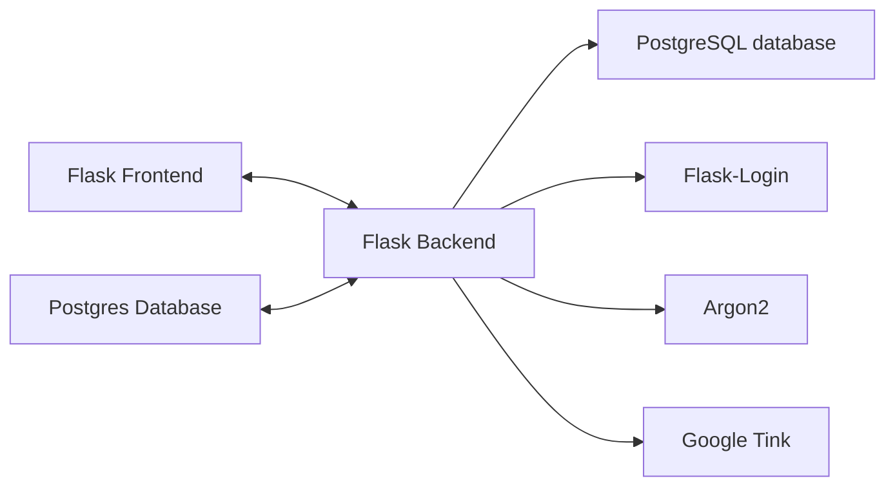
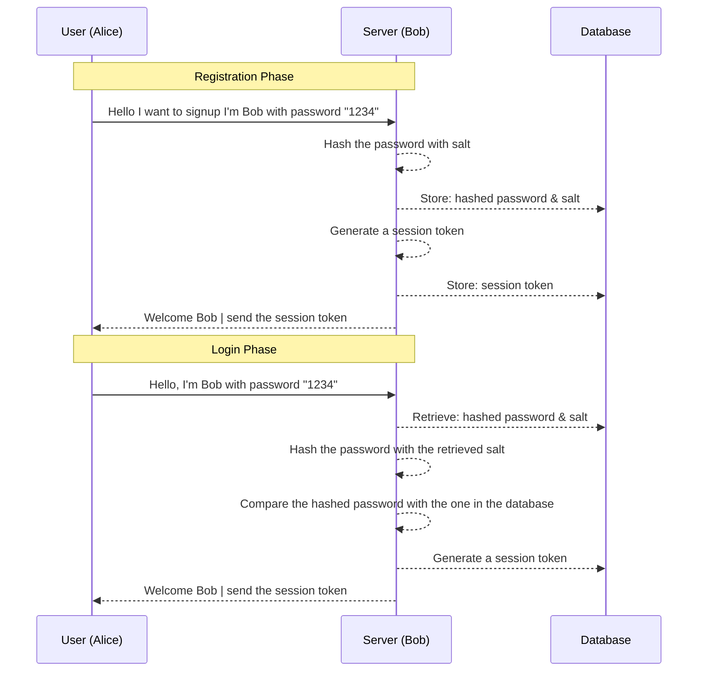

<div style="display: flex; justify-content: center; align-items: center; width: 500px; margin: 0 auto;">
    
    
    <div style="padding: 20px; text-align: center;">
        <h3 style="font-size: 16px;">Project CryptoGraphie - 1</h3>
        <h3 style="font-size: 16px;">Guillaume Dorschner & Jules Deleuse</h3>
        <h3 style="font-size: 16px;">A4 - CCC</h3>
    </div>
    
</div>

# Introduction

This project is a comprehensive exploration of cryptographic principles and their application in securing user data. Through a two-part implementation focusing on **password storage** and **Password-Authenticated Key Exchange (PAKE)** [see here](https://github.com/GuillaumeDorschner/ESILV-Cryptography-S8-2), this project demonstrates robust security practices in application development.


# Project Implementation

Requirement for the implementation: password storage. Think about it as you are building some application that has user system (username and password) and you need to store the password securely. You should implement your solution, taking into accounts all the attack scenarios we have discussed. Basically the grade will be scored according to how secure your implementation is. The implementation needs to be runnable, where I can enter my username and password for registration and logging in (the interface can be a web app, or terminal etc).

If you are using any cryptographic encryption implementation, you need to use [google tink library](https://developers.google.com/tink) (except for the hash functions). Implementation using other libraries does not count.

# Getting Started

## Installation

We use docker to run the application for simplicity. You can install docker from [here](https://docs.docker.com/get-docker/).

1. Download docker on your computer
2. Download the [release](https://github.com/GuillaumeDorschner/ESILV-Cryptography-S8-1/releases/latest) of the project
3. Change the example.env to .env and fill in the environment variables. Then run the following command to start the application:

```bash
docker compose up
```

# What we will be using

All the code is written in Python, and we will be using the following libraries:
- [Flask](https://flask.palletsprojects.com/en/3.0.x/)
- [PostgreSQL database](https://www.postgresql.org/)
- [Flask-Login](https://flask-login.readthedocs.io/en/latest/)
- [Argon2](https://en.wikipedia.org/wiki/Argon2)
- [Google Tink](https://developers.google.com/tink) for all cryptographic operations.



# Diagrams and Explanations

Example of Sequence Diagram.

### First part of the project: Password storage


